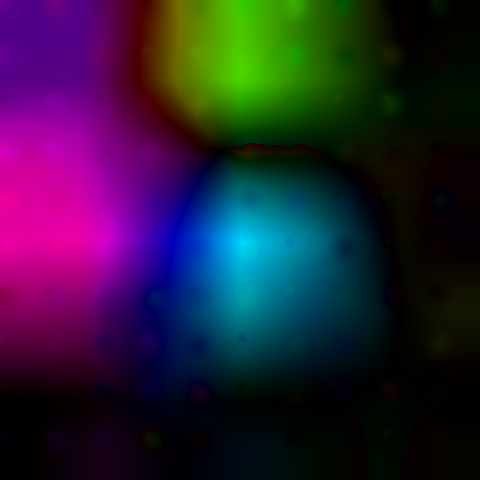

# Image distorter

This generates randomly some distortions and applies them to input file. Then the file is also rigidly transformed. Ground truth data are kept back for analysis.

The main use case are medical data.

## Example

Original (padded) image:

Locally distorted image:

Add global transformation:

Visualization of local distortions:

Data of [local distortions](example/oleg_l.png-local.png), [global transform](example/oleg_g.png.global.json).

## Copyright

Written by Oleg Lobachev, 2020, at MHH, released at BSD license (unless file header says differently).

